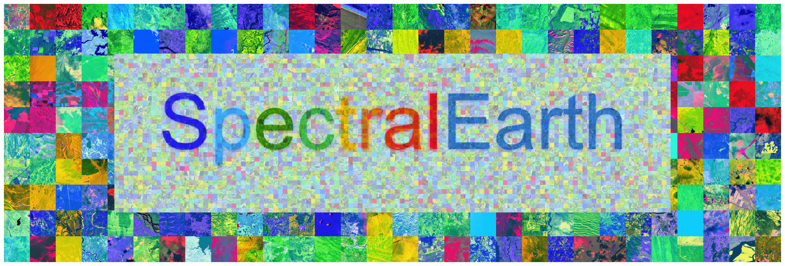
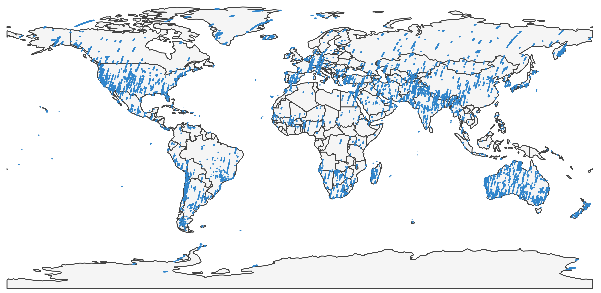
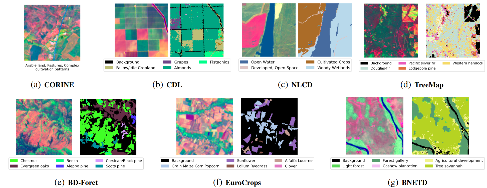

# Spectral Earth

This repository contains the code associated with the paper: [SpectralEarth: Training Hyperspectral Foundation Models at Scale](https://arxiv.org/abs/2408.08447).

> **Note:** The codebase is based on [ashleve/lightning-hydra-template](https://github.com/ashleve/lightning-hydra-template).

## Overview

The project focuses on pre-training hyperspectral models using data from the EnMAP mission. These models are fine-tuned on several crop-type/land-cover/tree-species classification downstream tasks.


*Figure: Overview of the Spectral Earth dataset.*

## Pre-training Dataset

The Spectral Earth dataset is a large-scale hyperspectral dataset collected from the EnMAP (Environmental Mapping and Analysis Program) satellite mission. It covers diverse geographic regions with about 3.3TB of hyperspectral imagery.



*Figure: Geographical Distribution of SpectralEarth.*

The dataset can be accessed and downloaded from the [DLR GeoService Portal](https://geoservice.dlr.de/web/datasets/enmap_spectralearth) after creating an account.


## Downstream Tasks

We evaluate our pretrained models on a diverse set of downstream tasks including classification, segmentation, and regression:

- **EnMAP-CDL** (Crop Type Segmentation – USA): Based on the [USDA Cropland Data Layer](https://www.nass.usda.gov/Research_and_Science/Cropland/SARS1a.php). 14 crop classes.
- **EnMAP-CORINE** (Land Cover Classification – Europe): Multi-label classification from the [CORINE Land Cover Map](https://land.copernicus.eu/pan-european/corine-land-cover), aggregated to 19 classes following the BigEarthNet taxonomy.
- **EnMAP-NLCD** (Land Cover Segmentation – USA): Pixel-wise segmentation based on the [National Land Cover Database (NLCD)](https://www.mrlc.gov/), with 15 classes.
- **EnMAP-EuroCrops** (Crop Type Segmentation – Europe): Based on the [EuroCrops dataset](https://github.com/Agri-Hub/EuroCrops), 15 classes.
- **EnMAP-BDForet** (Tree Species Segmentation – France): Segmentation of 12 tree species from the [IGN BDForêt V2 dataset](https://inventaire-forestier.ign.fr/spip.php?article646).
- **EnMAP-TreeMap** (Tree Species Segmentation – USA): Mapping of dominant tree species groups from the [US TreeMap dataset](https://www.fs.usda.gov/nrs/tools/treemap).
- **EnMAP-BNETD** (Land Cover Segmentation – Ivory Coast): Based on the [BNETD Land Cover Map](https://africageoportal.maps.arcgis.com/apps/webappviewer/index.html?id=88c2493e722546c09c2a0a8b394c4454), with 10 classes.
- **DESIS-CDL / EO-1-CDL** (Crop Type Segmentation – USA): Cross-sensor benchmarks on DESIS and Hyperion EO-1 imagery.
- **Hyperview** (Soil Property Regression – Intuition-1 Satellite): Evaluation on the [Hyperview Challenge](https://paperswithcode.com/dataset/hyperview).

---



*Figure: Overview of downstream tasks across sensors, regions, and task types.*


## Pretrained Models

Pretrained models are available for download [here](https://syncandshare.desy.de/index.php/s/Po5bTPipz6EEHx3).

## Pretrained Model Card

| Model Name       | Pretraining Algorithm(s) | Params  |
|------------------|--------------------------|---------|
| Spec. RN50       | MoCo-V2, DINO            | ~23M    |
| Spec. ViT-S      | MoCo-V2, DINO, MAE       | ~22M    |
| Spec. ViT-B      | MAE                      | ~86M    |
| Spec. ViT-L      | MAE                      | ~304M   |
| Spec. ViT-H      | MAE                      | ~630M   |
| Spec. ViT-g      | MAE                      | ~1.8B   |

## Installation

To set up the environment and install the required dependencies, please follow these steps:

1. **Clone the repository:**

   ```bash
   git clone https://github.com/yourusername/spectral-earth.git
   cd spectral-earth
   ```

2. **Install the required packages:**

   ```bash
   pip install -r requirements.txt
   ```


## Directory Structure

```
spectral-earth/
├── data/                   
│   ├── splits/                 # Train/val/test split files
│   └── statistics/             # Dataset statistics for normalization
├── src/                        # Source code
│   ├── backbones/              # Backbone network definitions
│   │   ├── spec_resnet.py      # ResNet-based backbone 
│   │   ├── spec_vit.py         # Vision Transformer-based backbone
│   │   └── spectral_adapter.py # Adapter module for spectral feature extraction
│   │   └── registery.py        # A registery to add new models
│   ├── datamodules/            # Data module definitions 
│   │   ├── enmap_cdl_nlcd.py   # Data module for CDL and NLCD datasets
│   │   └── ...
│   │   └── spectral_earth.py   # Data Module for the pre-training dataset
│   ├── datasets/               # Dataset classes
│   │   ├── enmap_cdl_nlcd.py   # Dataset class for CDL and NLCD datasets
│   │   └── ...
│   │   └── spectral_earth.py   # Pre-training dataset class
│   ├── models/                 # Lightning models
│   │   ├── multilabel_classification_module.py  # Multilabel classification module
│   │   └── semantic_segmentation_module.py  # Semantic segmentation module
│   │   └── regression_module.py             # Regression module
│   │   └── mae_module.py                    # Masked autoencoders module for pre-training
│   │   └── moco_module.py                   # MoCo-V2 module for pre-training
│   │   └── dino_module.py                   # DINO module for pre-training
│   └── transforms/             # Data transformation functions
│       └── normalize.py        # Normalization transforms
├── requirements.txt            # Required Python packages

```


## Running Experiments with Hydra

This repository uses [Hydra](https://hydra.cc/) for configuration management. The code is organized with separate configuration files for different tasks (e.g., pretraining, downstream classification/segmentation, etc.), and you can override any parameter from the command line.

### Configurations

The repository contains configuration files organized into groups. For example:

- **Pretraining with MoCo:**  
  The base configuration is located at `experiment/pretrain/moco/base.yaml`. Experiment-specific overrides are provided in files such as:
  - `experiment/pretrain/moco/spec_resnet50.yaml`
  - `experiment/pretrain/moco/spec_vit_small.yaml`

- **Downstream Tasks:**  
  Downstream tasks (e.g., classification and segmentation) have their own configuration directories (e.g., `experiment/downstream/cdl/`, etc.).

All configuration files follow the [Hydra configuration structure](https://hydra.cc/docs/intro/), allowing to mix and match defaults and override specific parameters.

### Running the Code

To run training, simply call the main training script and specify the configuration file using the `--config-name` option. For example, to start a pretraining experiment with the `spec_resnet50` backbone, run:

```bash
python src/train.py --multirun --config-name=pretrain experiment=pretrain/moco/spec_rn50.yaml
```

### Overriding Parameters

Hydra allows you to override any configuration parameter from the command line. For example, if you want to change the learning rate and batch size for a MoCo pretraining run, you can do:

```bash
python src/train.py --multirun --config-name=pretrain experiment=pretrain/moco/spec_rn50.yaml model.lr=0.01 data.batch_size=128
```

This command overrides the default learning rate defined in your configuration file and sets the batch size to 128.

You can override any parameter in any section of the configuration (e.g., `model`, `data`, `trainer`, etc.). For example:

```bash
python src/train.py --config-name=downstream experiment=downstream/cdl/spec_rn50.yaml model.pretrained_weights=/path/to/checkpoint model.freeze_backbone=true trainer.max_epochs=50
```

This command runs the CDL downstream task experiment with a frozen Spec. RN50 backbone for 50 epochs.

### Hydra Launcher

If you are using a cluster scheduler or need to run distributed training, you can specify a Hydra launcher. For example, if you are using a SLURM launcher, add the override:

```bash
python src/train.py --multirun --config-name=downstream experiment=downstream/cdl/spec_rn50.yaml model.pretrained_weights=/path/to/checkpoint model.freeze_backbone=true trainer.max_epochs=50 hydra/launcher=slurm
```

---

By following these instructions, you can run and manage experiments using Hydra and override any parameters as needed from the command line.


## Citation

If you use this code or the Spectral Earth dataset in your research, please cite our paper:

```bibtex
@article{braham2024spectralearth,
  title={SpectralEarth: Training Hyperspectral Foundation Models at Scale},
  author={Braham, Nassim Ait Ali and Albrecht, Conrad M and Mairal, Julien and Chanussot, Jocelyn and Wang, Yi and Zhu, Xiao Xiang},
  journal={arXiv preprint arXiv:2408.08447},
  year={2024}
}
```

## Acknowledgements

We would like to thank the the EnMAP mission team for providing the data and support throughout this project.

